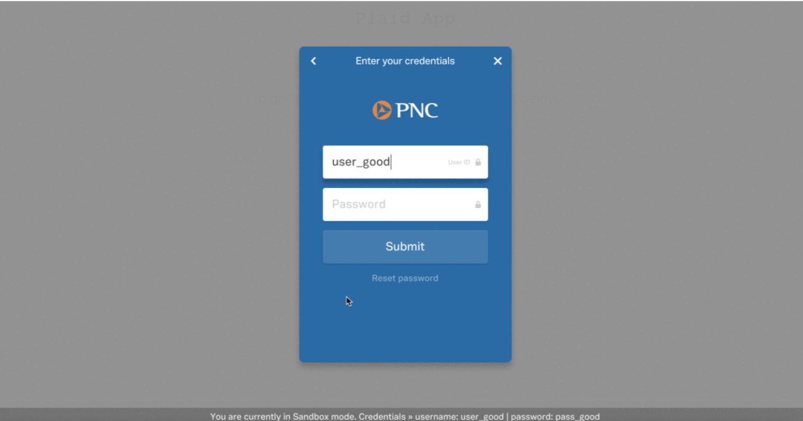

# Quanthium-Beta

Personal banking application that uses PLAID api to collect information from your bank on your behalf.
Plaid has wonderful documentation for developers on how to integrate with their service.


Full-stack banking web app built with [Plaid's API](https://plaid.com) and the MERN stack.

This project uses the following technologies:

- [React](https://reactjs.org) and [React Router](https://reacttraining.com/react-router/) for the frontend
- [Express](http://expressjs.com/) and [Node](https://nodejs.org/en/) for the backend
- [MongoDB](https://www.mongodb.com/) for the database
- [Redux](https://redux.js.org/basics/usagewithreact) for global state management
- [Plaid](https://plaid.com) for bank account linkage and transaction data

The app will allow users to
- Link multiple bank accounts
- Remove bank accounts
- View transactions from all linked accounts in a searchable and filterable data table

A brief description of each package and the function it will serve,

- [bcryptjs](https://www.npmjs.com/package/bcryptjs): used to hash passwords before we store them in our database
- [body-parser](https://www.npmjs.com/package/body-parser): used to parse incoming request bodies in a middleware
- [concurrently](https://www.npmjs.com/package/concurrently): allows us to run our backend and frontend concurrently and on different ports
- [express](https://www.npmjs.com/package/express): sits on top of Node to make the routing, request handling, and responding easier to write
- [is-empty](https://www.npmjs.com/package/is-empty): global function that will come in handy when we use validator
- [jsonwebtoken](https://www.npmjs.com/package/jsonwebtoken): used for authorization
- [mongoose](https://www.npmjs.com/package/mongoose): used to interact with MongoDB
- [passport](https://www.npmjs.com/package/passport): used to authenticate requests, which it does through an extensible set of plugins known as strategies
- [passport-jwt](https://www.npmjs.com/package/passport-jwt): passport strategy for authenticating with a JSON Web Token (JWT); lets you authenticate endpoints using a JWT
- [validator](https://www.npmjs.com/package/validator): used to validate inputs (e.g. check for valid email format, confirming passwords match)

## Configuration

### Mongo

Make sure to add your own `MONGOURI` from your [mLab](https://mlab.com) database in `config/keys.js`.

```javascript
module.exports = {
  mongoURI: "YOUR_MONGO_URI_HERE",
  secretOrKey: "secret"
};
```

### Plaid

Also, add your own [Plaid API](https://plaid.com) keys (`PLAID_CLIENT_ID`, `PLAID_SECRET`, and `PLAID_PUBLIC_KEY`) in

1. `routes/api/plaid.js`

```
const PLAID_CLIENT_ID = "YOUR_CLIENT_ID";
const PLAID_SECRET = "YOUR_SECRET";
const PLAID_PUBLIC_KEY = "YOUR_PUBLIC_KEY";
```

2. `client/src/components/dashboard/Dashboard.js` and `client/src/components/dashboard/Accounts.js`

```
<PlaidLinkButton
                buttonProps={{
                  className:
                    "btn btn-large waves-effect waves-light hoverable blue accent-3 main-btn"
                }}
                plaidLinkProps={{
                  clientName: "YOUR_APP_NAME",
                  key: "YOUR_PUBLIC_KEY",
                  env: "sandbox",
                  product: ["transactions"],
                  onSuccess: this.handleOnSuccess
                }}
                onScriptLoad={() => this.setState({ loaded: true })}
              >
                Link Account
              </PlaidLinkButton>
```

## Quick Start

```javascript
// Install dependencies for server & client
npm install && npm run client-install

// Run client & server with concurrently
npm run dev

// Server runs on http://localhost:5000 and client on http://localhost:3000
```